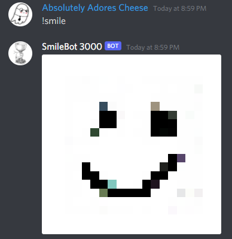

# Smile GAN

Ever wanted to train a GAN to generate some cool shit but you don't have $17,000,000 to blow on a computer with 237 Tesla V100s?

Here's some sickass code that will let you train your own GANs on simple 16x16 images. As a sample I taught this one to draw smiley faces.

To make your own kickass GAN:
1. Install fastai https://docs.fast.ai/
    - Use miniconda to install it unless you want to actually put in effort.
    - Yeah, even if you're on Linux or Mac.
1. Pick something simple to generate.
    - I said simple.
    - The more complex it is, the sadder you will be at the results.
    - Don't say I didn't warn you.
1. Draw 32 sample images of the thing you want your GAN to learn to draw.
    - Check out the Smiles/ folder for reference.
    - I drew 32 smiles.
    - :)
1. Point ai.ipynb at your new folder.
1. Run the code in ai.ipynb to train your beautiful GAN.
1. Go make a sandwich while it trains.
1. Idk, bundle it into a discord bot or something neato and flex on your friends.
    - See `from_model.ipynb` for steps to load your saved model.

